# **CFDPyRun**

This notebook consists of my run-through of Prof. Lorena Barba's "12 steps to Navier-Stokes" course, because I admit I have a problem with fluids. It is set in a "teacher first, student next" fashion, with the student developing the stock functions with his/her own ideas. The development is chronologically presented.

#### Python libraries


```python
import numpy
import sympy
from sympy import init_printing
from sympy.utilities.lambdify import lambdify
import time, sys
from matplotlib import rc, pyplot, cm
from sympy import init_printing
from mpl_toolkits.mplot3d import Axes3D 
init_printing(use_latex=True)
rc('font',**{'family':'serif'})
rc('text', usetex=True)
```

### **Step 1: 1-D Linear Convection**

#### Professor

Partial differential equation: $$ \frac{\partial u}{\partial t} + c\frac{\partial u}{\partial x} = 0 $$

Discretised: $$ \frac{u^{n+1}_i - u^n_i}{\Delta t} + c\frac{u^n_i - u^n_{i-1}}{\Delta x} = 0 $$


```python
nx = 41
dx = 2.0/(nx-1)
nt = 20
dt = 0.025
c = 1.0

u = numpy.ones(nx)
u[int (.5/dx): int(1/dx + 1)] = 2.0
print(u)

pyplot.figure(1)
pyplot.title('Virgin Barba')
pyplot.plot(numpy.linspace(0,2,nx), u)

for n in range(nt):
    un = u.copy()
    for i in range(1,nx):
        u[i] = un[i] - c*dt/dx*(un[i] - un[i-1])

pyplot.figure(2)
pyplot.title('Virgin Barba')
pyplot.plot(numpy.linspace(0,2,nx), u)
```

    [1. 1. 1. 1. 1. 1. 1. 1. 1. 1. 2. 2. 2. 2. 2. 2. 2. 2. 2. 2. 2. 1. 1. 1.
     1. 1. 1. 1. 1. 1. 1. 1. 1. 1. 1. 1. 1. 1. 1. 1. 1.]


    [<matplotlib.lines.Line2D at 0x7f624c865358>]


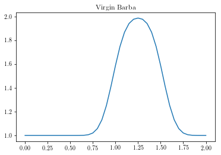


#### Student

No time left behind. (Down with mutability!)


```python
def linearConvection(nx):
    dx = 2.0/nx
    nt = 21
    dt = 0.025
    c = 1
    
    x = numpy.linspace(0,2,nx)
    u = numpy.ones((nt,nx))
    u[0][int (.5/dx): int(1/dx +1)] = 2.0
    print(u[0])

    for n in range(nt-1):
        for i in range(1,nx):
            u[n+1][i] = u[n][i] - c*dt/dx*(u[n][i] - u[n][i-1])
    
    pyplot.figure(1)
    pyplot.title('Chad Torpedo')
    pyplot.plot(x, u[0], label='Initial')
    pyplot.plot(x, u[nt-1], label='Final')
    pyplot.legend()

linearConvection(40)
```

    [1. 1. 1. 1. 1. 1. 1. 1. 1. 1. 2. 2. 2. 2. 2. 2. 2. 2. 2. 2. 2. 1. 1. 1.
     1. 1. 1. 1. 1. 1. 1. 1. 1. 1. 1. 1. 1. 1. 1. 1.]


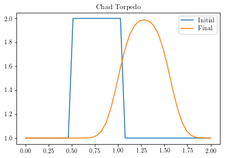


### **Step 2: 1-D Nonlinear Convection**

#### Professor

Partial differential equation: $$ \frac{\partial u}{\partial t} + u\frac{\partial u}{\partial x} = 0 $$

Discretised: $$ \frac{u^{n+1}_i - u^n_i}{\Delta t} + u^n_i\frac{u^n_i - u^n_{i-1}}{\Delta x} = 0 $$


```python
nx = 41
dx = 2.0/(nx-1)
nt = 20
dt = 0.025

u = numpy.ones(nx)
u[int (.5/dx): int(1/dx + 1)] = 2.0
print(u)

pyplot.figure(1)
pyplot.title('Virgin Barba')
pyplot.plot(numpy.linspace(0,2,nx), u)

for n in range(nt):
    un = u.copy()
    for i in range(1,nx):
        u[i] = un[i]*(1 - dt/dx*(un[i] - un[i-1]))

pyplot.plot(numpy.linspace(0,2,nx), u)
```

    [1. 1. 1. 1. 1. 1. 1. 1. 1. 1. 2. 2. 2. 2. 2. 2. 2. 2. 2. 2. 2. 1. 1. 1.
     1. 1. 1. 1. 1. 1. 1. 1. 1. 1. 1. 1. 1. 1. 1. 1. 1.]


    [<matplotlib.lines.Line2D at 0x7f624cb2fa20>]


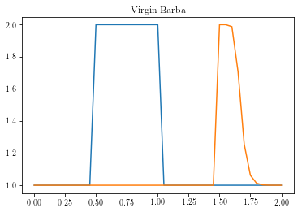


#### Student


```python
def nonLinearConvection(nx):
    dx = 2.0/nx
    nt = 20
    dt = 0.025
    
    u = numpy.ones((nt,nx))
    u[0][int (.5/dx): int(1/dx + 1)] = 2.0
    print(u[0])

    for n in range(nt-1):
        for i in range(1,nx):
            u[n+1][i] = u[n][i]*(1 - dt/dx*(u[n][i] - u[n][i-1]))
            
    pyplot.figure(2)
    pyplot.title('Chad Torpedo')
    pyplot.plot(numpy.linspace(0,2,nx), u[0], numpy.linspace(0,2,nx), u[nt-1])

nonLinearConvection(40)
```

    [1. 1. 1. 1. 1. 1. 1. 1. 1. 1. 2. 2. 2. 2. 2. 2. 2. 2. 2. 2. 2. 1. 1. 1.
     1. 1. 1. 1. 1. 1. 1. 1. 1. 1. 1. 1. 1. 1. 1. 1.]


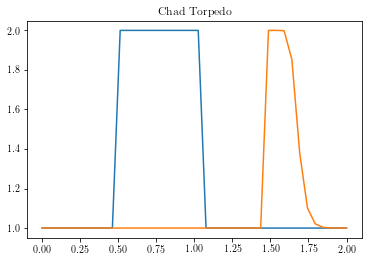


### **Investigation: CFL Condition**

#### Professor

Courant number: $$ \sigma = \frac{u\Delta t}{\Delta x} \leq \sigma_{\max} $$


```python
def linearconv(nx):
    dx = 2.0/(nx-1)
    nt = 20
    c = 1.0
    sigma = 0.5
    dt = sigma*dx
    
    u = numpy.ones(nx)
    u[int (.5/dx): int(1/dx + 1)] = 2.0
    print(u)

    pyplot.figure(1)
    pyplot.title('Virgin Barba')
    pyplot.plot(numpy.linspace(0,2,nx), u)

    for n in range(nt):
        un = u.copy()
        for i in range(1,nx):
            u[i] = un[i] - c*dt/dx*(un[i] - un[i-1])

    pyplot.plot(numpy.linspace(0,2,nx), u)

linearconv(101)
```

    [1. 1. 1. 1. 1. 1. 1. 1. 1. 1. 1. 1. 1. 1. 1. 1. 1. 1. 1. 1. 1. 1. 1. 1.
     1. 2. 2. 2. 2. 2. 2. 2. 2. 2. 2. 2. 2. 2. 2. 2. 2. 2. 2. 2. 2. 2. 2. 2.
     2. 2. 2. 1. 1. 1. 1. 1. 1. 1. 1. 1. 1. 1. 1. 1. 1. 1. 1. 1. 1. 1. 1. 1.
     1. 1. 1. 1. 1. 1. 1. 1. 1. 1. 1. 1. 1. 1. 1. 1. 1. 1. 1. 1. 1. 1. 1. 1.
     1. 1. 1. 1. 1.]


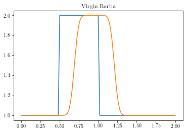


#### Student

This function allows you to input the simulation time and time-step size and provides warnings if the Courant Number is greater than 1 with recommendations.


```python
def linearConvectionCFL(mesh_size, time, dt):
    dx = 2.0/mesh_size
    c = 1
    time_steps = int(time/dt)
    sigma_max = dt/dx
    if sigma_max > 1:
        correct_dt = dx
        print('Warning: CFL Number greater than 1. Solver will probably produce incorrect results. Maximum time-step should be %s.' %correct_dt)
    ## Initial condition definition
    u = numpy.ones((time_steps,mesh_size))
    u[0][int (.5/dx): int(1/dx + 1)] = 2.0
    print(u[0])

    for n in range(time_steps-1):
        for i in range(1,mesh_size):
            u[n+1][i] = u[n][i] - c*dt/dx*(u[n][i] - u[n][i-1])
            
    pyplot.figure(2)
    pyplot.title('Chad Torpedo')
    pyplot.plot(numpy.linspace(0,2,mesh_size), u[0], numpy.linspace(0,2,mesh_size), u[time_steps-1])
    
linearConvectionCFL(100, 0.2, 0.021)
```

    Warning: CFL Number greater than 1. Solver will probably produce incorrect results. Maximum time-step should be 0.02.
    [1. 1. 1. 1. 1. 1. 1. 1. 1. 1. 1. 1. 1. 1. 1. 1. 1. 1. 1. 1. 1. 1. 1. 1.
     1. 2. 2. 2. 2. 2. 2. 2. 2. 2. 2. 2. 2. 2. 2. 2. 2. 2. 2. 2. 2. 2. 2. 2.
     2. 2. 2. 1. 1. 1. 1. 1. 1. 1. 1. 1. 1. 1. 1. 1. 1. 1. 1. 1. 1. 1. 1. 1.
     1. 1. 1. 1. 1. 1. 1. 1. 1. 1. 1. 1. 1. 1. 1. 1. 1. 1. 1. 1. 1. 1. 1. 1.
     1. 1. 1. 1.]


### **Step 3: Diffusion Equation in 1-D**

#### Professor

Partial differential equation: $$ \frac{\partial u}{\partial t} = \nu \frac{\partial^2 u}{\partial x^2} $$

Discretised: $$ \frac{u^{n+1}_i - u^n_i}{\Delta t} = \nu\frac{u^n_{i+1} - 2u^n_i + u^n_{i-1}}{\Delta x^2} $$


```python
nx = 41
dx = 2.0/(nx-1)
nt = 20
nu = 0.3
sigma = 0.2
dt = sigma*dx**2/nu

u = numpy.ones(nx)
u[int (.5/dx): int(1/dx + 1)] = 2.0
print(u)

pyplot.figure(1)
pyplot.title('Virgin Barba')
pyplot.plot(numpy.linspace(0,2,nx), u)

for n in range(nt):
    un = u.copy()
    for i in range(1,nx - 1):
        u[i] = un[i] + nu*dt/dx**2*(un[i+1] - 2*un[i] + un[i-1] )

pyplot.plot(numpy.linspace(0,2,nx), u)
```

    [1. 1. 1. 1. 1. 1. 1. 1. 1. 1. 2. 2. 2. 2. 2. 2. 2. 2. 2. 2. 2. 1. 1. 1.
     1. 1. 1. 1. 1. 1. 1. 1. 1. 1. 1. 1. 1. 1. 1. 1. 1.]


    [<matplotlib.lines.Line2D at 0x7f624cb9d978>]


#### Student

This version forces the Courant Number to be 0.2 and calculates the time-step based on the mesh size accordingly for "accurate" results. It also takes user input of simulation time.


```python
def diffusionEquation(mesh_size, time):
    dx = 2.0/mesh_size
    nu = 0.3
    sigma_max = 0.2
    dt = sigma_max*dx**2/nu
    time_steps = int(time/dt)
    
    ## Initial condition definition
    u = numpy.ones((time_steps,mesh_size))
    u[0][int (.5/dx): int(1/dx + 1)] = 2.0
    print(u[0])

    for n in range(time_steps-1):
        for i in range(1,mesh_size - 1):
            u[n+1][i] = u[n][i] + nu*dt/dx**2*(u[n][i+1] - 2*u[n][i] + u[n][i-1])

    pyplot.figure(2)
    pyplot.title('Chad Torpedo')
    pyplot.plot(numpy.linspace(0,2,mesh_size), u[0], label='Initial')
    pyplot.plot(numpy.linspace(0,2,mesh_size), u[time_steps-1], label='Final')
    pyplot.legend()

diffusionEquation(100, 0.0333333)
```

    [1. 1. 1. 1. 1. 1. 1. 1. 1. 1. 1. 1. 1. 1. 1. 1. 1. 1. 1. 1. 1. 1. 1. 1.
     1. 2. 2. 2. 2. 2. 2. 2. 2. 2. 2. 2. 2. 2. 2. 2. 2. 2. 2. 2. 2. 2. 2. 2.
     2. 2. 2. 1. 1. 1. 1. 1. 1. 1. 1. 1. 1. 1. 1. 1. 1. 1. 1. 1. 1. 1. 1. 1.
     1. 1. 1. 1. 1. 1. 1. 1. 1. 1. 1. 1. 1. 1. 1. 1. 1. 1. 1. 1. 1. 1. 1. 1.
     1. 1. 1. 1.]


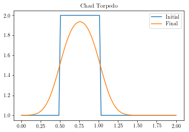


### **Step 4: Burgers' Equation**

### Professor

Partial differential equation: 

$$ \frac{\partial u}{\partial t} + u\frac{\partial u}{\partial x} = \nu\frac{\partial^2 u}{\partial x^2} $$

Discretised: $$ \frac{u^{n+1}_i - u^n_i}{\Delta t} + u^n_i\frac{u^n_i - u^n_{i-1}}{\Delta x} = \nu\frac{u^n_{i+1} - 2u^n_i + u^n_{i-1}}{\Delta x^2} $$

Initial conditions: 

$$ u(x,0) = -\frac{2\nu}{\phi}\frac{\partial\phi}{\partial x} + 4 $$

$$ \phi(x,0) = \exp\left(\frac{-x^2}{4\nu}\right) + \exp\left(\frac{-(x-2\pi)^2}{4\nu}\right) $$

Boundary condition: $$ u(0,t) = u(2\pi,t) $$


```python
x, t, nu = sympy.symbols('x t nu')
phi = sympy.exp(-(x-4*t)**2/(4*nu*(t+1))) + sympy.exp(-(x-4*t-2*numpy.pi)**2/(4*nu*(t+1)))
diffphi = sympy.diff(phi, x)
u = -2*nu/phi*diffphi + 4
ufunc = sympy.lambdify((t,x,nu), u)

nx = 81
dx = 2.0*numpy.pi/(nx-1)
nt = 100
nu = 0.07
dt = dx*nu

x = numpy.linspace(0, 2*numpy.pi,nx)
un = numpy.empty(nx)
t = 0

u = numpy.asarray([ufunc(t,x0,nu) for x0 in x])
print(u)

pyplot.figure(1,figsize=(11, 7))
pyplot.title('Virgin Barba')
pyplot.plot(x, u, marker='o', lw=2)
pyplot.xlim([0, 2 * numpy.pi])
pyplot.ylim([0, 10])

for n in range(nt):
    un = u.copy()
    for i in range(1,nx-1):
        u[i] = un[i]*(1-dt/dx*(un[i] - un[i-1])) + nu*dt/dx**2*(un[i+1] - 2*un[i] + un[i-1])
    u[0] = un[0]*(1-dt/dx*(un[0] - un[-2])) + nu*dt/dx**2*(un[1] - 2*un[0] + un[-2])
    u[-1] = u[0]

u_analytical = numpy.asarray([ufunc(nt*dt, xi, nu) for xi in x])

pyplot.figure(2,figsize=(11, 7))
pyplot.plot(x, u, marker='o', lw=2, label='Computational')
pyplot.plot(x, u_analytical, label='Analytical')
pyplot.xlim([0, 2 * numpy.pi])
pyplot.ylim([0, 10])
pyplot.legend()
```

    [4.         4.07853982 4.15707963 4.23561945 4.31415927 4.39269908
     4.4712389  4.54977871 4.62831853 4.70685835 4.78539816 4.86393798
     4.9424778  5.02101761 5.09955743 5.17809725 5.25663706 5.33517688
     5.41371669 5.49225651 5.57079633 5.64933614 5.72787596 5.80641578
     5.88495559 5.96349541 6.04203522 6.12057504 6.19911486 6.27765467
     6.35619449 6.43473431 6.51327412 6.59181394 6.67035375 6.74889343
     6.82742866 6.90581263 6.97906612 6.88327117 4.         1.11672883
     1.02093388 1.09418737 1.17257134 1.25110657 1.32964625 1.40818606
     1.48672588 1.56526569 1.64380551 1.72234533 1.80088514 1.87942496
     1.95796478 2.03650459 2.11504441 2.19358422 2.27212404 2.35066386
     2.42920367 2.50774349 2.58628331 2.66482312 2.74336294 2.82190275
     2.90044257 2.97898239 3.0575222  3.13606202 3.21460184 3.29314165
     3.37168147 3.45022129 3.5287611  3.60730092 3.68584073 3.76438055
     3.84292037 3.92146018 4.        ]


    <matplotlib.legend.Legend at 0x7f624c706eb8>


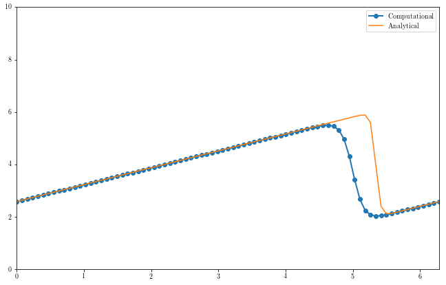


#### Student


```python
def burgersEquation(mesh_size, time):
    dx = 2.0*numpy.pi/(mesh_size-1)
    nu = 0.07
    dt = dx*nu
    timesteps = int(time/dt)
    
    x = numpy.linspace(0, 2*numpy.pi, mesh_size)
    u = numpy.empty((timesteps,mesh_size))
    
    u[0] = numpy.asarray([ufunc(0,x0,nu) for x0 in x])
    
    pyplot.figure(3,figsize=(11, 7))
    pyplot.title('Chad Torpedo')
    pyplot.plot(x, u[0], marker='o', lw=2, label = 'Initial')
    pyplot.xlim([0, 2*numpy.pi])
    pyplot.ylim([0, 10])
    
    for n in range(timesteps-1):
        for i in range(1,mesh_size-1):
            u[n+1][i] = u[n][i]*(1-dt/dx*(u[n][i] - u[n][i-1])) + nu*dt/dx**2*(u[n][i+1] - 2*u[n][i] + u[n][i-1]) 
            u[n+1][0] = u[n][0]*(1-dt/dx*(u[n][0] - u[n][-2])) + nu*dt/dx**2*(u[n][1] - 2*u[n][0] + u[n][-2])
            u[n+1][-1] = u[n+1][0]
            
    u_analytical = numpy.asarray([ufunc(timesteps*dt, xi, nu) for xi in x])
    
    pyplot.figure(3,figsize=(11, 7))
    pyplot.plot(x, u[timesteps-1], marker='o', lw=2, label='Computational Result')
    pyplot.plot(x, u_analytical, label='Analytical Result')
    pyplot.xlim([0, 2*numpy.pi])
    pyplot.ylim([0, 10])
    pyplot.legend()
    
burgersEquation(101,0.5)
```


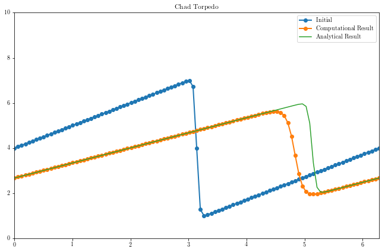


### **Aside: Kardar–Parisi–Zhang equation**

#### Student

The KPZ equation is a generalisation of Burgers' equation to multiple dimensions. Write Burgers' equation in the form:

$$ \frac{\partial u}{\partial t} + \frac{1}{2}\frac{\partial u^2}{\partial x} = \nu\frac{\partial^2 u}{\partial x^2} $$

Let $ u = \psi_x $, then Burgers' equation becomes:

$$ \psi_{tx} + \psi_x\psi_{xx} = \nu\psi_{xxx} $$

$$ \partial_x\left(\psi_t + \frac{\psi_x^2}{2} \right) = \nu\partial_x(\psi_{xx}) $$ 

Integrating with respect to x gives the following equation:

$$ \frac{\partial \psi}{\partial t} + \frac{1}{2}\left(\frac{\partial \psi}{\partial x}\right)^2 = \nu\frac{\partial^2 \psi}{\partial x^2} $$

This is the KPZ equation in one dimension, which seemingly generalises to:

$$ \frac{\partial \psi}{\partial t} + \frac{\lambda}{2}\left(\nabla \psi\right)^2 = \nu\nabla^2 \psi $$

Whatever "$(\nabla \psi)^2$" means. Let $\lambda = 2$ and take the one-dimensional case, then the equation has an integrating factor (thanks to Vyn from freenode's `##math`!), which allows it to be written in the form of the 1-D diffusion equation:

$$ \frac{\partial}{\partial t}\left[\exp\left(-\frac{\psi}{\nu}\right)\right] = \nu\frac{\partial^2}{\partial x^2}\left[\exp\left(-\frac{\psi}{\nu}\right)\right] $$ 

TODO: Add solution.

### **Step 5: 2-D Linear Convection**

#### Professor

Partial differential equation: $$ \frac{\partial u}{\partial t} + c\left(\frac{\partial u}{\partial x} + \frac{\partial u}{\partial y} \right) = 0 $$

Discretised: $$ \frac{u^{n+1}_{i,j} - u^n_{i,j}}{\Delta t} + c\left(\frac{u^n_{i,j} - u^n_{i-1,j}}{\Delta x} + \frac{u^n_{i,j} - u^n_{i,j-1}}{\Delta y}\right) = 0 $$`

*Student's note:* This function has been modified to take two options, a "fast" (which uses array operations with NumPy) and a "slow" (which uses `for` loops). For fast, input `1` into the function, otherwise input any other number for slow.


```python
def linearconv2D(fast):
    nx = 81
    ny = 81
    dx = 2.0/(nx - 1)
    dy = 2.0/(ny - 1)
    c = 1
    sigma = 0.2
    nt = 100
    dt = sigma*dx
    
    x = numpy.linspace(0, 2, nx)
    y = numpy.linspace(0, 2, ny)
    
    u = numpy.ones((ny,nx))
    un = numpy.ones((ny,nx))
    u[int(0.5/dy):int(1.0/dy + 1),int(.5/dx):int(1.0/dx + 1)] = 2 
    
    fig = pyplot.figure(1,figsize=(11,7),dpi=100)
    ax = fig.gca(projection='3d')
    X, Y = numpy.meshgrid(x,y)
    surf = ax.plot_surface(X, Y, u[:], cmap=cm.viridis)
    
    if fast == 1:
        for n in range(nt + 1):
            u[1:,1:] = u[1:,1:] - c*dt*((u[1:,1:] - u[:-1,1:])/dx + (u[1:,1:] - u[1:,:-1])/dy)
            u[0,:] = 1
            u[-1,:] = 1
            u[:,0] = 1
            u[:,-1] = 1
    else:
        for n in range(nt + 1):
            un = u.copy()
            row, col = u.shape
            for j in range(1, row):
                for i in range(1, col):
                    u[j,i] = un[j,i] - c*dt*((u[j,i] - u[j,i-1])/dx + (u[j,i] - u[j-1,i])/dy)
                    u[0,:] = 1
                    u[-1,:] = 1
                    u[:,0] = 1
                    u[:,-1] = 1

    fig = pyplot.figure(2,figsize=(11, 7), dpi=100)
    ax = fig.gca(projection='3d')
    surf2 = ax.plot_surface(X, Y, u[:], cmap=cm.viridis)
    
linearconv2D(1)
```


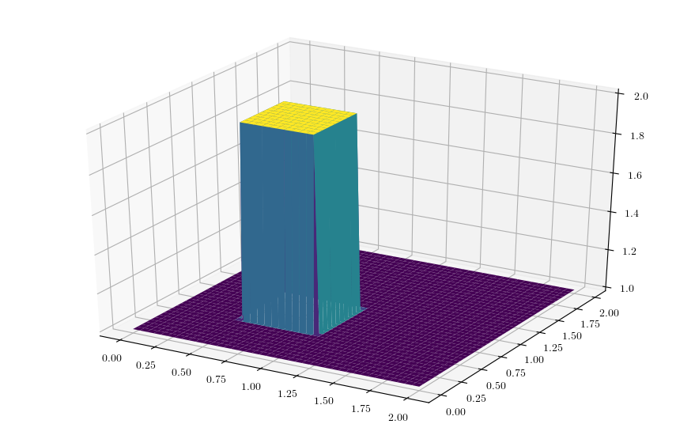


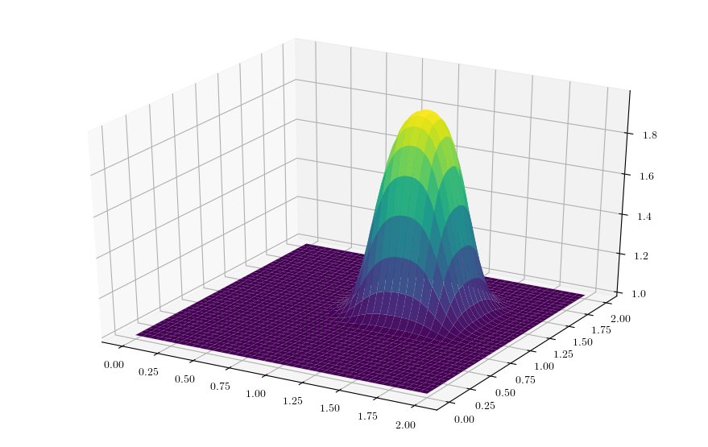


#### Student

This function takes the mesh size in each direction as separate inputs and also the required simulation time. It minimises the timestep based on the smaller grid distance between `x` and `y` for accuracy (at the cost of speed!).


```python
def linearConvection2D(mesh_size_x, mesh_size_y, time):
    dx = 2/(mesh_size_x - 1)
    dy = 2/(mesh_size_y - 1)
    c = 1
    sigma = 0.2
    dt = sigma*min(dx,dy)
    timesteps = int(time/dt)
    
    x = numpy.linspace(0,2, mesh_size_x)
    y = numpy.linspace(0,2, mesh_size_y)
    
    u = numpy.ones((timesteps, mesh_size_x, mesh_size_y))
    u[0][int(0.5/dy):int(1.0/dy + 1),int(.5/dx):int(1.0/dx + 1)] = 2
    fig = pyplot.figure(3,figsize=(11,7),dpi=100)
    ax = fig.gca(projection='3d')
    X, Y = numpy.meshgrid(x,y)
    surf = ax.plot_surface(X, Y, u[0], cmap=cm.viridis)
    
    for n in range(timesteps-1):
        u[n+1][1:,1:] = u[n][1:,1:] - c*dt*((u[n][1:,1:] - u[n][:-1,1:])/dx + (u[n][1:,1:] - u[n][1:,:-1])/dy)
        u[n+1][0,:] = 1
        u[n+1][-1,:] = 1
        u[n+1][:,0] = 1
        u[n+1][:,-1] = 1
        
    fig = pyplot.figure(4,figsize=(11, 7), dpi=100)
    ax = fig.gca(projection='3d')
    X, Y = numpy.meshgrid(x,y)
    surf2 = ax.plot_surface(X, Y, u[timesteps-1][:], cmap=cm.viridis)
    
linearConvection2D(201, 201, 2.5/5.0)
```


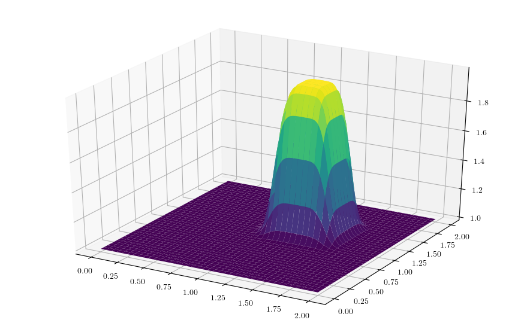


### **Step 6: 2-D Convection**

#### Professor

Coupled partial differential equations:

$$ \frac{\partial u}{\partial t} + u\frac{\partial u}{\partial x} + v\frac{\partial u}{\partial y}  = 0 $$

$$ \frac{\partial v}{\partial t} + u\frac{\partial v}{\partial x} + v\frac{\partial v}{\partial y}  = 0 $$

Discretised:

$$ \frac{u^{n+1}_{i,j} - u^n_{i,j}}{\Delta t} + u^n_{i,j}\left(\frac{u^n_{i,j} - u^n_{i-1,j}}{\Delta x}\right) + v^n_{i,j}\left(\frac{u^n_{i,j} - u^n_{i,j-1}}{\Delta y}\right) = 0 $$

$$ \frac{v^{n+1}_{i,j} - v^n_{i,j}}{\Delta t} + u^n_{i,j}\left(\frac{v^n_{i,j} - v^n_{i-1,j}}{\Delta x}\right) + v^n_{i,j}\left(\frac{v^n_{i,j} - v^n_{i,j-1}}{\Delta y}\right) = 0 $$

Initial conditions:

$$ u, v = \begin{cases} 2, & \mathrm{for}\; x,y \in [0.5,1] \times [0.5,1] \\ 1, & \mathrm{everywhere\;else} \end{cases}$$

Boundary conditions:

$$ u = 1, v = 1 \;\mathrm{for} \begin{cases} x = 0,2 \\ y = 0,2 \end{cases} $$


```python
nx = 101
ny = 101
nt = 80
c = 1
dx = 2.0/(nx-1)
dy = 2.0/(nx-1)
sigma = 0.2
dt = sigma*dx

x = numpy.linspace(0, 2, nx)
y = numpy.linspace(0, 2, ny)

u = numpy.ones((ny, nx))
v = numpy.ones((ny, nx))
un = numpy.ones((ny, nx))
vn = numpy.ones((ny, nx))

u[int(.5/dy):int(1/dy + 1),int(.5/dx):int(1/dx+1)] = 2
v[int(.5/dy):int(1/dy + 1),int(.5/dx):int(1/dx+1)] = 2

fig = pyplot.figure(figsize=(11, 7), dpi=100)
ax = fig.gca(projection='3d')
X, Y = numpy.meshgrid(x, y)

ax.plot_surface(X, Y, u, cmap=cm.viridis, rstride=2, cstride=2)
ax.set_xlabel('$x$')
ax.set_ylabel('$y$');

```


#### Student

These PDEs can be written concisely in tensor notation using Einstein's summation convention:

$$ \partial_t V^{\alpha} + V^{\mu}\partial_{\mu}V^{\alpha} = 0 $$ 

Discretised:

$$ \frac{V^{\alpha, n}_{i,j} - V^{\alpha, n - 1}_{i,j}}{\Delta t} + V^{\mu} $$
